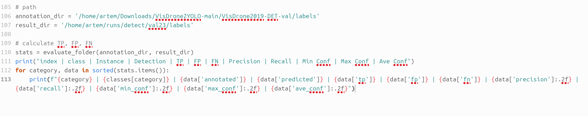

# YOLO-SAHI
This repository provides the source code for the thesis project "Improving Small Object Detection from Drones Using SAHI-YOLO".
# Instructions
## Installation
Install the following dependencies:
```
Anaconda          # Create inference and training environments on Ubuntu
```
Install your desired version of pytorch and torchvision:
```
pip install torch==2.7.0 torchvision==0.22.0 --index-url https://download.pytorch.org/whl/cu126
```
Install your desired detection framework (ultralytics):
```
pip install ultralytics>=8.3.161
```
Install SAHI:
```
pip install sahi
```
## Data Preparation
1. Download the [VisDrone](https://github.com/VisDrone/VisDrone-Dataset?tab=readme-ov-file) dataset(find Task1: Object Detection in Images and download folders: trainset, valset and testset-dev, and put the data into ```datasets/visdrone/.```
2. Download [VisDrone2YOLO](https://github.com/adityatandon/VisDrone2YOLO) - Converted labels from the VisDrone dataset to the YOLO format. Put this data into ```datasets/visdrone/labels```
3. After downloading, place the data in the following directory structure:
```
dataset/
├── visdrone/
│ ├── VisDrone2019-DET-train/
│ │ ├── images/
│ │ └── labels/
│ ├── VisDrone2019-DET-val/
│ │ ├── images/
│ │ └── labels/
│ └── VisDrone2019-DET-test_dev/
│ │ ├── images/
│ │ └── labels/
```
4. Use [Yolo-to-COCO-format-converter](https://github.com/Taeyoung96/Yolo-to-COCO-format-converter) to convert the VisDrone dataset's labels to COCO format (.json) for SAHI testing.
Requirements:<br>

numpy<br>
OpenCV<br>
You can make same environment with anaconda environment.
```
conda create -n Yolo-to-COCO python=3.8
conda activate Yolo-to-COCO
pip install numpy
pip install opencv-python
pip install imagesize
```
Just clone this repository.
```
git clone https://github.com/Taeyoung96/Yolo-to-COCO-format-converter.git
cd Yolo-to-COCO-format-converter
```
Change classes with your own dataset.<br>

In main.py, there is a code that declare the classes. You will change this with your obj.names.<br>
 <br>
Annotations are nested in a folder 'YOLO_darknet' <br>
Use this approach if your annotations are in nested a level below the image files like this:
```
    dataset_root_dir/
        YOLO_darknet/
            Photo_00001.txt
            Photo_00002.txt
        Photo_00001.jpg
        Photo_00002.jpg
```
Command to use:
```
python main.py --yolo-subdir --path <datasets/visdrone/dataset_root_dir> --output <VisDrone2019-DET_test_coco_start>
```
5. Convert YOLO (.txt) to COCO (.json) format for prediction outputs of YOLOv9–v12 models (without SAHI integration)<br>
Provide paths to the images and labels as shown in this figure<br>
 <br>
Command to use:
```
python convert.py
```
## Models Training
### YOLOv9
Follow these instructions to train the YOLOv9-E:
1. Docker environment (recommended)
```
# create the docker container, you can change the share memory size if you have more.
nvidia-docker run --name yolov9 -it -v your_coco_path/:/coco/ -v your_code_path/:/yolov9 --shm-size=64g nvcr.io/nvidia/pytorch:21.11-py3

# apt install required packages
apt update
apt install -y zip htop screen libgl1-mesa-glx

# pip install required packages
pip install seaborn thop

# go to code folder
cd /yolov9
```
2. Download the [YOLOv9-e model](https://github.com/artyomko111/YOLO-SAHI/blob/main/models/yolov9-e.yaml) and make sure that ```nc: 10```, since our project also uses 10 classes.
3. Train the YOLOv9-E model on the VisDrone dataset using the following command
```
# Train the yolov9-e model for 500 epochs
python train_dual.py --workers 2 --device 0 --batch 1 --data data/data_visdrone.yaml --img 1280 --cfg models/detect/yolov9-e.yaml --weights '' --name yolov9-e --hyp hyp.scratch-high.yaml --min-items 0 --epochs 500 --close-mosaic 15 --save_json True
```
### YOLOv10
Follow these instructions to train the YOLOV10-X:
1. Create the conda environment
```
conda create -n yolov10 python=3.9
conda activate yolov10

# Move to the YOLOV10 directory
cd train/YOLOv10
```
2. Download the [YOLOv10-X model](https://github.com/artyomko111/YOLO-SAHI/blob/main/models/yolov10x.yaml) and make sure that ```nc: 10```, since our project also uses 10 classes.
3. Install the dependencies
```
pip install -r requirements.txt
pip install -e .
```
4. Train the YOLOV10-X model on the VisDrone dataset using the following command
```
# Train the yolov10-x model for 500 epochs
yolo detect train data= data/data_visdrone.yaml model= models/detect/yolov10x.yaml epochs=500 batch=2 imgsz=1280 device=0 save_json=True
```
### YOLOv11
Follow these instructions to train the YOLOV11-X:
1. Create the conda environment
```
conda create -n yolov11 python=3.11
conda activate yolov11

# Move to the YOLOv11 directory
cd train/YOLOv11
```
2. Download the [YOLOv11-X model](https://github.com/artyomko111/YOLO-SAHI/blob/main/models/yolov11x_modified.yaml) and make sure that ```nc: 10```, since our project also uses 10 classes.
3. Install the dependencies
```
pip install ultralytics
```
4. Train the YOLOv11-X model on the VisDrone dataset using the following command
```
# Train the yolov11-x model for 500 epochs
yolo detect train data=data/data_visdrone.yaml model=models/detect/yolov11x-modified.yaml epochs=500 batch=2 imgsz=1280 device=0 save_json=True
```
### YOLOv12
1. Create the conda environment
```
conda create -n yolov12 python=3.11
conda activate yolov12

# Move to the YOLOv12 directory
cd train/YOLOv12
```
2. Download the [YOLOv12-X model](https://github.com/artyomko111/YOLO-SAHI/blob/main/models/yolov12x_modified.yaml) and make sure that ```nc: 10```, since our project also uses 10 classes.
3. Install the dependencies
```
wget https://github.com/Dao-AILab/flash-attention/releases/download/v2.7.3/flash_attn-2.7.3+cu11torch2.2cxx11abiFALSE-cp311-cp311-linux_x86_64.whl
pip install -r requirements.txt
pip install -e .
```
4. Train the YOLOv12-X model on the VisDrone dataset using the following command
```
# Train the yolov12-x model for 500 epochs
yolo detect train data=data/data_visdrone.yaml model=models/detect/yolov12x-modified.yaml epochs=500 batch=2 imgsz=1280 device=0 save_json=True
```
## Prediction with SAHI
You can specify additional sliced prediction parameters as:
```
sahi predict --slice_width 1024 --slice_height 1024 --overlap_height_ratio 0.2 --overlap_width_ratio 0.2 --postprocess_match_metric IOU --postprocess_match_threshold 0.65 --model_confidence_threshold 0.5 --source dataset/visdrone/VisDrone2019-DET-test_dev/images --model_path detect/weights/best.pt --model_config_path data/data_visdrone.yaml --model_type ultralytics
```
• Specify detection framework as ```--model_type ultralytics``` for Ultralytics, to match with your model weight file<br>
• Specify postprocess type as ```--postprocess_type GREEDYNMM``` or ```--postprocess_type NMS``` to be applied over sliced predictions<br>
• Specify postprocess match metric as ```--postprocess_match_metric IOS``` for intersection over smaller area or ```--postprocess_match_metric IOU``` for intersection over union<br>
• Specify postprocess match threshold as ```--postprocess_match_threshold 0.65```<br>
• If you don't want to export prediction visuals, add ```--novisual``` argument.<br>
• By default, scripts apply both standard and sliced prediction (multi-stage inference). If you don't want to perform sliced prediction add ```--no_sliced_prediction argument```. If you don't want to perform standard prediction add ```--no_standard_prediction argument```.<br>
• Provide COCO json labels file, which was converted into the 'Data Preparation' section  ```--dataset_json_path VisDrone2019-DET_test_coco_start.json``` and image folder as ```--source dataset/visdrone/VisDrone2019-DET-test_dev/images```, predictions will be exported as a coco json file to runs/predict/exp/results.json. Then you can use coco_evaluation command to calculate COCO evaluation results or coco_error_analysis command to calculate detailed COCO error plots.<br>
## COCO evaluation
Run the following command to perform COCO evaluation.<br>
```sahi coco evaluate --dataset_json_path VisDrone2019-DET_test_coco_start.json --result_json_path result.json```<br>
Provide the COCO-format JSON labels file, which was converted as described in the 'Data Preparation' section ```--dataset_json_path VisDrone2019-DET_test_coco_start.json```, and the prediction JSON file generated in the previous step ```--result_json_path result.json```.<br>
If you want to specify max detections, set it as ```--proposal_nums "[10 100 500]"```.<br>
Use this code to get Precision and Recall metrics.<br>
```python Precision, Recall.py``` <br>
Inside the code, under the comment ```# Load your COCO annotations JSON files```, specify the path to the file ```VisDrone2019-DET_test_coco_start.json```.
Under the comment ```# Load the prediction results from results.json```, specify the path to the ```results.json``` file generated after SAHI prediction.<br>
Use this script to compute mAP@50, mAP@75, and mAP@90 for each class from COCO-format JSON predictions.<br>
```python val_sahi.py```<br>
Inside this code, just like in the previous one, under the comment ```# ===Download dataset===```, specify the path to the ```VisDrone2019-DET_test_coco_start.json``` file, and also specify the path to the ```results.json``` file generated after the SAHI prediction.In the line ```def compute_ap_class(class_id, iou_thres=0.5)```, change the value to 0.75 or 0.9 to compute the corresponding mAP metrics.
## Experimental Results
### Training Results
Table 1. YOLOv9-E training results
| Labels |   TP  |  FP  |   FN  |   P   |   R   | mAP@.5 | mAP@.5:.95 |
|:------:|:-----:|:----:|:-----:|:-----:|:-----:|:------:|:----------:|
|  38759 | 22552 | 4757 | 11831 | 0.843 | 0.405 |  0.618 |    0.468   |
<br>
Table 2. YOLOv10-X training results

| Labels |   TP  |  FP  |   FN  |   P   |   R  | mAP@.5 | mAP@.5:.95 |
|:------:|:-----:|:----:|:-----:|:-----:|:----:|:------:|:----------:|
|  38759 | 21846 | 3177 | 16744 | 0.655 | 0.57 |  0.602 |    0.389   |
<br>
Table 3. YOLOv11-X training results

| Labels |   TP  |  FP  |   FN  |   P   |   R   | mAP@.5 | mAP@.5:.95 |
|:------:|:-----:|:----:|:-----:|:-----:|:-----:|:------:|:----------:|
|  38759 | 21733 | 4936 | 16811 | 0.796 | 0.452 |  0.618 |    0.456   |
<br>
Table 4. YOLOv12-X training results

| Labels |   TP  |  FP  |   FN  |   P   |   R   | mAP@.5 | mAP@.5:.95 |
|:------:|:-----:|:----:|:-----:|:-----:|:-----:|:------:|:----------:|
|  38759 | 35726 | 5723 | 30567 | 0.651 | 0.573 |  0.601 |    0.386   |
<br>
Table 5. YOLOv9-C3k2_SHSA training results

| Labels |   TP  |  FP  |   FN  |   P   |   R  | mAP@.5 | mAP@.5:.95 |
|:------:|:-----:|:----:|:-----:|:-----:|:----:|:------:|:----------:|
|  38759 | 21733 | 4936 | 16811 | 0.755 | 0.37 |  0.555 |    0.388   |
<br>
Table 6. YOLOv10-C2f_SHSA training results

| Labels |   TP  |  FP  |   FN  |   P   |   R   | mAP@.5 | mAP@.5:.95 |
|:------:|:-----:|:----:|:-----:|:-----:|:-----:|:------:|:----------:|
|  38759 | 32740 | 5157 | 42295 | 0.775 | 0.332 |  0.545 |    0.385   |
<br>
Table 7. YOLOv12-C3k2_SHSA training results

| Labels |   TP  |  FP  |   FN  |   P   |   R   | mAP@.5 | mAP@.5:.95 |
|:------:|:-----:|:----:|:-----:|:-----:|:-----:|:------:|:----------:|
|  38759 | 20713 | 2446 | 54360 | 0.836 | 0.182 |  0.507 |    0.39    |

• To obtain the metric results for Labels, TP (True Positives), FP (False Positives), and FN (False Negatives) from Tables 1–7, we use the ```TPFPFN.py``` script located in the dataprocessing folder.<br>
• According to the picture below, we first need to specify the path to the YOLO .txt annotation files from our dataset in the line ```annotation_dir```, and the path to the annotations obtained after testing our model, also in YOLO .txt format, in the line ```results_dir``` <br>

