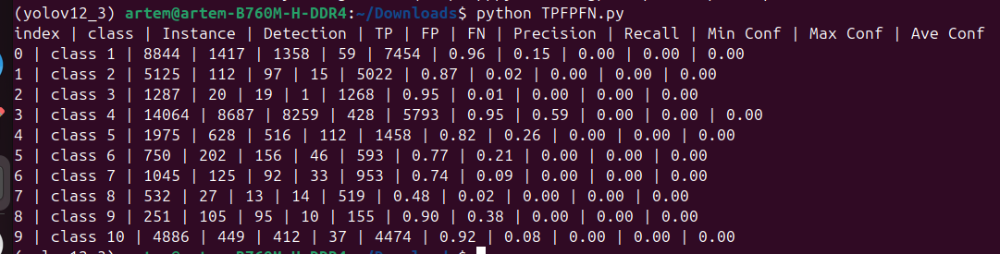
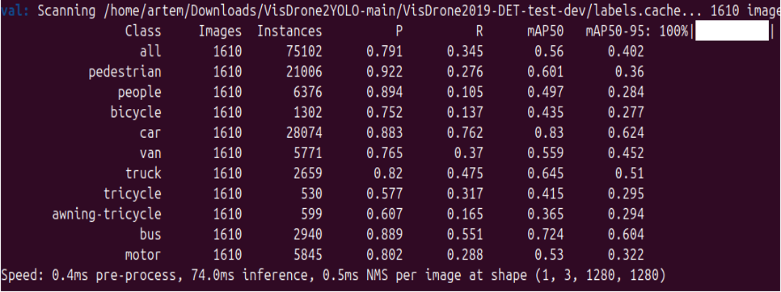
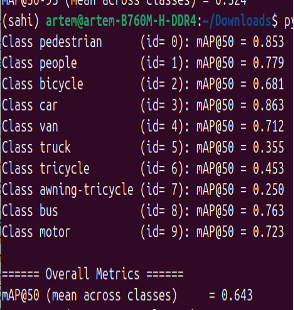

# YOLO-SAHI
This repository provides the source code for the thesis project "Improving Small Object Detection from Drones Using SAHI-YOLO".
# Instructions
## Installation
Install the following dependencies:
```
Anaconda          # Create inference and training environments on Ubuntu
```
Install your desired version of pytorch and torchvision:
```
pip install torch==2.7.0 torchvision==0.22.0 --index-url https://download.pytorch.org/whl/cu126
```
Install your desired detection framework (ultralytics):
```
pip install ultralytics>=8.3.161
```
Install SAHI:
```
pip install sahi
```
## Data Preparation
1. Download the [VisDrone](https://github.com/VisDrone/VisDrone-Dataset?tab=readme-ov-file) dataset(find Task1: Object Detection in Images and download folders: trainset, valset and testset-dev, and put the data into ```datasets/visdrone/.```
2. Download [VisDrone2YOLO](https://github.com/adityatandon/VisDrone2YOLO) - Converted labels from the VisDrone dataset to the YOLO format. Put this data into ```datasets/visdrone/labels```
3. After downloading, place the data in the following directory structure:
```
dataset/
├── visdrone/
│ ├── VisDrone2019-DET-train/
│ │ ├── images/
│ │ └── labels/
│ ├── VisDrone2019-DET-val/
│ │ ├── images/
│ │ └── labels/
│ └── VisDrone2019-DET-test_dev/
│ │ ├── images/
│ │ └── labels/
```
4. Use [Yolo-to-COCO-format-converter](https://github.com/Taeyoung96/Yolo-to-COCO-format-converter) to convert the VisDrone dataset's labels to COCO format (.json) for SAHI testing.
Requirements:<br>

numpy<br>
OpenCV<br>
You can make same environment with anaconda environment.
```
conda create -n Yolo-to-COCO python=3.8
conda activate Yolo-to-COCO
pip install numpy
pip install opencv-python
pip install imagesize
```
Just clone this repository.
```
git clone https://github.com/Taeyoung96/Yolo-to-COCO-format-converter.git
cd Yolo-to-COCO-format-converter
```
Change classes with your own dataset.<br>

In main.py, there is a code that declare the classes. You will change this with your obj.names.<br>
 <br>
Annotations are nested in a folder 'YOLO_darknet' <br>
Use this approach if your annotations are in nested a level below the image files like this:
```
    dataset_root_dir/
        YOLO_darknet/
            Photo_00001.txt
            Photo_00002.txt
        Photo_00001.jpg
        Photo_00002.jpg
```
Command to use:
```
python main.py --yolo-subdir --path <datasets/visdrone/dataset_root_dir> --output <VisDrone2019-DET_test_coco_start>
```
5. Convert YOLO (.txt) to COCO (.json) format for prediction outputs of YOLOv9–v12 models (without SAHI integration)<br>
Provide paths to the images and labels as shown in this figure<br>
 <br>
Command to use:
```
python convert.py
```
## Models Training
### YOLOv9
Follow these instructions to train the YOLOv9-E:
1. Docker environment (recommended)
```
# create the docker container, you can change the share memory size if you have more.
nvidia-docker run --name yolov9 -it -v your_coco_path/:/coco/ -v your_code_path/:/yolov9 --shm-size=64g nvcr.io/nvidia/pytorch:21.11-py3

# apt install required packages
apt update
apt install -y zip htop screen libgl1-mesa-glx

# pip install required packages
pip install seaborn thop

# go to code folder
cd /yolov9
```
2. Download the [YOLOv9-e model](https://github.com/artyomko111/YOLO-SAHI/blob/main/models/yolov9-e.yaml) and make sure that ```nc: 10```, since our project also uses 10 classes.
3. Train the YOLOv9-E model on the VisDrone dataset using the following command
```
# Train the yolov9-e model for 500 epochs
python train_dual.py --workers 2 --device 0 --batch 1 --data data/data_visdrone.yaml --img 1280 --cfg models/detect/yolov9-e.yaml --weights '' --name yolov9-e --hyp hyp.scratch-high.yaml --min-items 0 --epochs 500 --close-mosaic 15 --save_json True
```
### YOLOv10
Follow these instructions to train the YOLOV10-X:
1. Create the conda environment
```
conda create -n yolov10 python=3.9
conda activate yolov10

# Move to the YOLOV10 directory
cd train/YOLOv10
```
2. Download the [YOLOv10-X model](https://github.com/artyomko111/YOLO-SAHI/blob/main/models/yolov10x.yaml) and make sure that ```nc: 10```, since our project also uses 10 classes.
3. Install the dependencies
```
pip install -r requirements.txt
pip install -e .
```
4. Train the YOLOV10-X model on the VisDrone dataset using the following command
```
# Train the yolov10-x model for 500 epochs
yolo detect train data= data/data_visdrone.yaml model= models/detect/yolov10x.yaml epochs=500 batch=2 imgsz=1280 device=0 save_json=True
```
### YOLOv11
Follow these instructions to train the YOLOV11-X:
1. Create the conda environment
```
conda create -n yolov11 python=3.11
conda activate yolov11

# Move to the YOLOv11 directory
cd train/YOLOv11
```
2. Download the [YOLOv11-X model](https://github.com/artyomko111/YOLO-SAHI/blob/main/models/yolov11x_modified.yaml) and make sure that ```nc: 10```, since our project also uses 10 classes.
3. Install the dependencies
```
pip install ultralytics
```
4. Train the YOLOv11-X model on the VisDrone dataset using the following command
```
# Train the yolov11-x model for 500 epochs
yolo detect train data=data/data_visdrone.yaml model=models/detect/yolov11x-modified.yaml epochs=500 batch=2 imgsz=1280 device=0 save_json=True
```
### YOLOv12
1. Create the conda environment
```
conda create -n yolov12 python=3.11
conda activate yolov12

# Move to the YOLOv12 directory
cd train/YOLOv12
```
2. Download the [YOLOv12-X model](https://github.com/artyomko111/YOLO-SAHI/blob/main/models/yolov12x_modified.yaml) and make sure that ```nc: 10```, since our project also uses 10 classes.
3. Install the dependencies
```
wget https://github.com/Dao-AILab/flash-attention/releases/download/v2.7.3/flash_attn-2.7.3+cu11torch2.2cxx11abiFALSE-cp311-cp311-linux_x86_64.whl
pip install -r requirements.txt
pip install -e .
```
4. Train the YOLOv12-X model on the VisDrone dataset using the following command
```
# Train the yolov12-x model for 500 epochs
yolo detect train data=data/data_visdrone.yaml model=models/detect/yolov12x-modified.yaml epochs=500 batch=2 imgsz=1280 device=0 save_json=True
```
## Prediction with SAHI
You can specify additional sliced prediction parameters as:
```
sahi predict --slice_width 1024 --slice_height 1024 --overlap_height_ratio 0.2 --overlap_width_ratio 0.2 --postprocess_match_metric IOU --postprocess_match_threshold 0.65 --model_confidence_threshold 0.5 --source dataset/visdrone/VisDrone2019-DET-test_dev/images --model_path detect/weights/best.pt --model_config_path data/data_visdrone.yaml --model_type ultralytics
```
• Specify detection framework as ```--model_type ultralytics``` for Ultralytics, to match with your model weight file<br>
• Specify postprocess type as ```--postprocess_type GREEDYNMM``` or ```--postprocess_type NMS``` to be applied over sliced predictions<br>
• Specify postprocess match metric as ```--postprocess_match_metric IOS``` for intersection over smaller area or ```--postprocess_match_metric IOU``` for intersection over union<br>
• Specify postprocess match threshold as ```--postprocess_match_threshold 0.65```<br>
• If you don't want to export prediction visuals, add ```--novisual``` argument.<br>
• By default, scripts apply both standard and sliced prediction (multi-stage inference). If you don't want to perform sliced prediction add ```--no_sliced_prediction argument```. If you don't want to perform standard prediction add ```--no_standard_prediction argument```.<br>
• Provide COCO json labels file, which was converted into the 'Data Preparation' section  ```--dataset_json_path VisDrone2019-DET_test_coco_start.json``` and image folder as ```--source dataset/visdrone/VisDrone2019-DET-test_dev/images```, predictions will be exported as a coco json file to runs/predict/exp/results.json. Then you can use coco_evaluation command to calculate COCO evaluation results or coco_error_analysis command to calculate detailed COCO error plots.<br>
## COCO evaluation
Run the following command to perform COCO evaluation.<br>
```sahi coco evaluate --dataset_json_path VisDrone2019-DET_test_coco_start.json --result_json_path result.json```<br>
Provide the COCO-format JSON labels file, which was converted as described in the 'Data Preparation' section ```--dataset_json_path VisDrone2019-DET_test_coco_start.json```, and the prediction JSON file generated in the previous step ```--result_json_path result.json```.<br>
If you want to specify max detections, set it as ```--proposal_nums "[10 100 500]"```.<br>
Use this code to get Precision and Recall metrics.<br>
```python Precision, Recall.py``` <br>
Inside the code, under the comment ```# Load your COCO annotations JSON files```, specify the path to the file ```VisDrone2019-DET_test_coco_start.json```.
Under the comment ```# Load the prediction results from results.json```, specify the path to the ```results.json``` file generated after SAHI prediction.<br>
Use this script to compute mAP@50, mAP@75, and mAP@90 for each class from COCO-format JSON predictions.<br>
```python val_sahi.py```<br>
Inside this code, just like in the previous one, under the comment ```# ===Download dataset===```, specify the path to the ```VisDrone2019-DET_test_coco_start.json``` file, and also specify the path to the ```results.json``` file generated after the SAHI prediction.In the line ```def compute_ap_class(class_id, iou_thres=0.5)```, change the value to 0.75 or 0.9 to compute the corresponding mAP metrics.
## Experimental Results
### Training Results
Table 1. YOLOv9-E training results
| Labels |   TP  |  FP  |   FN  |   P   |   R   | mAP@.5 | mAP@.5:.95 |
|:------:|:-----:|:----:|:-----:|:-----:|:-----:|:------:|:----------:|
|  38759 | 22552 | 4757 | 11831 | 0.843 | 0.405 |  0.618 |    0.468   |
<br>
Table 2. YOLOv10-X training results

| Labels |   TP  |  FP  |   FN  |   P   |   R  | mAP@.5 | mAP@.5:.95 |
|:------:|:-----:|:----:|:-----:|:-----:|:----:|:------:|:----------:|
|  38759 | 21846 | 3177 | 16744 | 0.655 | 0.57 |  0.602 |    0.389   |
<br>
Table 3. YOLOv11-X training results

| Labels |   TP  |  FP  |   FN  |   P   |   R   | mAP@.5 | mAP@.5:.95 |
|:------:|:-----:|:----:|:-----:|:-----:|:-----:|:------:|:----------:|
|  38759 | 21733 | 4936 | 16811 | 0.796 | 0.452 |  0.618 |    0.456   |
<br>
Table 4. YOLOv12-X training results

| Labels |   TP  |  FP  |   FN  |   P   |   R   | mAP@.5 | mAP@.5:.95 |
|:------:|:-----:|:----:|:-----:|:-----:|:-----:|:------:|:----------:|
|  38759 | 35726 | 5723 | 30567 | 0.651 | 0.573 |  0.601 |    0.386   |
<br>
Table 5. YOLOv9-C3k2_SHSA training results

| Labels |   TP  |  FP  |   FN  |   P   |   R  | mAP@.5 | mAP@.5:.95 |
|:------:|:-----:|:----:|:-----:|:-----:|:----:|:------:|:----------:|
|  38759 | 21733 | 4936 | 16811 | 0.755 | 0.37 |  0.555 |    0.388   |
<br>
Table 6. YOLOv10-C2f_SHSA training results

| Labels |   TP  |  FP  |   FN  |   P   |   R   | mAP@.5 | mAP@.5:.95 |
|:------:|:-----:|:----:|:-----:|:-----:|:-----:|:------:|:----------:|
|  38759 | 32740 | 5157 | 42295 | 0.775 | 0.332 |  0.545 |    0.385   |
<br>
Table 7. YOLOv12-C3k2_SHSA training results

| Labels |   TP  |  FP  |   FN  |   P   |   R   | mAP@.5 | mAP@.5:.95 |
|:------:|:-----:|:----:|:-----:|:-----:|:-----:|:------:|:----------:|
|  38759 | 20713 | 2446 | 54360 | 0.836 | 0.182 |  0.507 |    0.39    |

• To obtain the metric results for Labels, TP (True Positives), FP (False Positives), and FN (False Negatives) from Tables 1–7, we use the ```TPFPFN.py``` script located in the dataprocessing folder.<br>
• According to the picture below, we first need to specify the path to the YOLO .txt annotation files from our dataset in the line ```annotation_dir```, and the path to the annotations obtained after testing our model(```save_txt=True```), also in YOLO .txt format, in the line ```result_dir``` <br>

• This is the final result we obtain. Now, we need to sum the values of ```TP```, ```FP```, and ```FN``` across all classes and record them in a table.

• As for the values of Precision, Recall, mAP@50, and mAP@50-95, they can be obtained from the table after training the model or by using the following command:<br>
```yolo val model=/YOLOv12_SHSA/weights/best.pt data=/VisDrone/data_visdrone.yaml batch=2 iou=0.65 conf=0.5```<br>
In the ```data_visdrone.yaml``` file, you need to specify the path to the folder ```VisDrone2YOLO-main/VisDrone2019-DET-val/images``` in the ```val:``` field<br>
Table 8. Comprehensive Comparison Table of All Test Results

| Total Labels=75102 |   P   |   R   | mAP@.5 | mAP@.75 | mAP@.90 | mAP@.5:95 |  FPS  |
|:------------------:|:-----:|:-----:|:------:|:-------:|:-------:|:---------:|:-----:|
| YOLOv9-E           | 0.791 | 0.345 |  0.56  |  0.429  |  0.146  |   0.402   | 30.96 |
| YOLOv9+SAHI        | 0.785 | 0.592 |  0.729 |  0.564  |  0.217  |   0.516   |  1.14 |
| YOLOv10-X          | 0.723 | 0.378 |  0.543 |  0.411  |  0.136  |   0.371   | 57.14 |
| YOLOv10+SAHI       | 0.783 | 0.563 |  0.723 |  0.537  |  0.183  |   0.491   |  2.21 |
| YOLOv11-X          | 0.727 | 0.405 |  0.557 |   0.42  |  0.143  |   0.387   |  7.00 |
| YOLOv11+SAHI       | 0.792 | 0.565 |  0.739 |  0.597  |  0.224  |   0.524   |  0.69 |
| YOLOv12-X          | 0.764 | 0.356 |  0.55  |  0.440  |  0.157  |    0.3    |  18.5 |
| YOLOv12+SAHI       | 0.830 | 0.530 |  0.643 |  0.498  |  0.174  |   0.451   |  0.27 |
| YOLOv9+C3k2_SHSA   | 0.755 |  0.37 |  0.555 |    -    |    -    |   0.388   | 25.18 |
| YOLOv10+C2f_SHSA   |  0.72 |  0.4  |  0.552 |  0.418  |  0.133  |   0.377   | 26.32 |
| YOLOv12+C3k_SHSA   | 0.814 | 0.163 |  0.487 |    -    |    -    |   0.352   |  7.35 |

• In Table 8, the metrics Precision, Recall, mAP@50, and mAP@50-95 for YOLOv9-E, YOLOv10-X, YOLOv11-X, YOLOv12-X, YOLOv9+C3k2_SHSA, YOLOv10+C2f_SHSA, and YOLOv12+C3k_SHSA were obtained using the following command:<br>
```yolo val model=/YOLOv12_SHSA/weights/best.pt data=/VisDrone/data_visdrone.yaml batch=2 iou=0.65 conf=0.5``` 
In the ```data_visdrone.yaml``` file, you need to specify the path to the folder ```VisDrone2YOLO-main/VisDrone2019-DET-test-dev/images``` in the ```val:``` field<br>
<br>
• In Table 8, the metrics mAP@.75 and mAP@.90 for YOLOv9-E, YOLOv10-X, YOLOv11-X, YOLOv12-X, YOLOv9+C3k2_SHSA, YOLOv10+C2f_SHSA, YOLOv12+C3k_SHSA were obtained using the following command:<br>
```python cocoapi.py```<br>
Inside the code, under the comment ```# Load your COCO annotations JSON files```, specify the path to the file ```annotations_yolo.json```.
Under the comment ```# Load the prediction results from results.json```, specify the path to the ```results.json``` file generated after after testing our model(```save_json=True```). Also add the following line before ```cocoEval.evaluate()```: ```cocoEval.params.iouThrs = [0.5, 0.75, 0.9]```<br>
• In Table 8, the metrics Precision, Recall for YOLOv9+SAHI, YOLOv10+SAHI, YOLOv11+SAHI, YOLOv12+SAHI were obtained using the following command:<br>
```python Precision, Recall.py``` <br>
Inside the code, under the comment ```# Load your COCO annotations JSON files```, specify the path to the file ```VisDrone2019-DET_test_coco_start.json```.
Under the comment ```# Load the prediction results from results.json```, specify the path to the ```results.json``` file generated after SAHI prediction.<br>
• In Table 8, the metrics mAP@.50, mAP@.75, mAP@.90, and mAP@50-95 for YOLOv9+SAHI, YOLOv10+SAHI, YOLOv11+SAHI, YOLOv12+SAHI were obtained using the following command:<br>
```python val_sahi.py```<br>
Inside this code, just like in the previous one, under the comment ```# ===Download dataset===```, specify the path to the ```VisDrone2019-DET_test_coco_start.json``` file, and also specify the path to the ```results.json``` file generated after the SAHI prediction.In the line ```def compute_ap_class(class_id, iou_thres=0.5)```, change the value to 0.75 or 0.9 to compute the corresponding mAP metrics.
As a result, we obtain the following output, as shown in the figure below. The required metrics are then copied into the table.
<br>
• ```FPS``` metric was calculated using the formula: 1000 / total processing time.<br>
Table 9. Comprehensive Comparison Table of All Test Results-2

| Total Labels=75102 |   TP  |  FP  |   FN  | mAP@50 | mAP@.75 | mAP@.90 | mAP@.95 |
|:------------------:|:-----:|:----:|:-----:|:------:|:-------:|:-------:|:-------:|
| YOLOv9-E           | 35003 | 5199 | 31321 |  0.306 |  0.255  |  0.205  |  0.213  |
| YOLOv9+SAHI        | 54143 | 1200 |  5506 |  0.394 |  0.273  |  0.247  |  0.254  |
| YOLOv10-X          | 37069 | 7592 | 34161 |  0.325 |  0.235  |  0.207  |  0.214  |
| YOLOv10+SAHI       | 51077 | 1088 |  5983 |  0.375 |  0.254  |  0.237  |  0.230  |
| YOLOv11-X          | 36958 | 7161 | 38002 |  0.349 |  0.256  |  0.225  |  0.232  |
| YOLOv11+SAHI       | 51574 | 1075 |  6277 |  0.373 |  0.260  |  0.233  |  0.240  |
| YOLOv12-X          | 35726 | 5723 | 30567 |  0.311 |  0.241  |  0.207  |  0.214  |
| YOLOv12-SAHI       | 39822 | 8144 | 35280 |  0.333 |  0.244  |  0.216  |  0.222  |
| YOLOv9+C3k2_SHSA   | 21733 | 4936 | 16811 |  0.323 |  0.242  |  0.210  |  0.218  |
| YOLOv10+C2f_SHSA   | 32740 | 5157 | 42295 |  0.343 |  0.246  |  0.217  |  0.224  |
| YOLOv12+C3k2_SHSA  | 20713 | 2446 | 54360 |  0.366 |  0.223  |  0.212  |  0.216  |
<br>
• To obtain the metric results for Labels, TP (True Positives), FP (False Positives), and FN (False Negatives) from Tables 9, we use the ```TPFPFN.py```    script located in the dataprocessing folder.<br>
• To obtain mAP@50, mAP@75, mAP@90, and mAP@95, the ```cocoapi.py``` script was used. The cocoGt variable was assigned the path to the COCO annotations, while the cocoDt variable was assigned the path to ```result.json``` generated after prediction. To obtain ```mAP@90``` , add the following line before  ```cocoEval.evaluate()``` : ```cocoEval.params.iouThrs = [0.5, 0.75, 0.9]``` . <br>
Table 10. Comparison Results of Various Methods on the Testset-Dev in the VisDrone-DET Dataset.

|       Methods      | Images |  AP50  |  AP(S) |  AP(M) |  AP(L) |
|:------------------:|:------:|:------:|:------:|:------:|:------:|
|     HIC-YOLOv5     |  1610  | 36.95% |    -   |    -   |    -   |
|   PVswin-YOLOv8s   |  1610  | 35.20% |    -   |    -   |    -   |
|        SimD        |  1610  | 32.80% |    -   |    -   |    -   |
|        DIPKD       |  1610  | 31.92% |  9.56% | 25.90% | 38.98% |
|       AdaZoom      |  1610  | 56.16% |    -   |    -   |    -   |
|       MDAMDL       |  1610  | 52.00% |    -   |    -   |    -   |
|  YOLOv9+SAHI(Ours) |  1610  | 72.90% | 15.60% | 36.60% | 49.30% |
|       YOLOv9       |  1610  | 56.00% | 11.00% | 33.30% | 47.40% |
| YOLOv10+SAHI(Ours) |  1610  | 72.30% | 14.20% | 34.70% | 40.20% |
|       YOLOv10      |  1610  | 53.30% | 11.90% | 32.70% | 38.60% |
| YOLOv11+SAHI(Ours) |  1610  | 73.90% | 14.50% | 35.10% | 44.50% |
|       YOLOv11      |  1610  | 55.70% | 13.50% | 34.10% | 46.90% |
| YOLOv12+SAHI(Ours) |  1610  | 64.30% | 14.00% | 32.00% | 28.50% |
|       YOLOv12      |  1610  | 55.00% | 11.80% | 32.90% | 40.70% |

•   The performance metrics presented in Table 11 for the proposed models (YOLOv9+SAHI, YOLOv10+SAHI, YOLOv11+SAHI, and YOLOv12+SAHI) were obtained using the SAHI prediction module. After running the prediction process with SAHI, the evaluation of results was conducted using the COCO API via the following command:<br>
```sahi coco evaluate --dataset_json_path VisDrone2019-DET_test_coco_start.json --result_json_path result.json --proposal_nums 100```<br>
where VisDrone2019-DET_test_coco_start.json is the ground truth file converted from YOLO .txt labels to COCO .json format, and result.json contains predictions from the SAHI inference process.<br>
For other methods shown in Table 11, the results were collected directly from the official papers or repositories, as cited.

