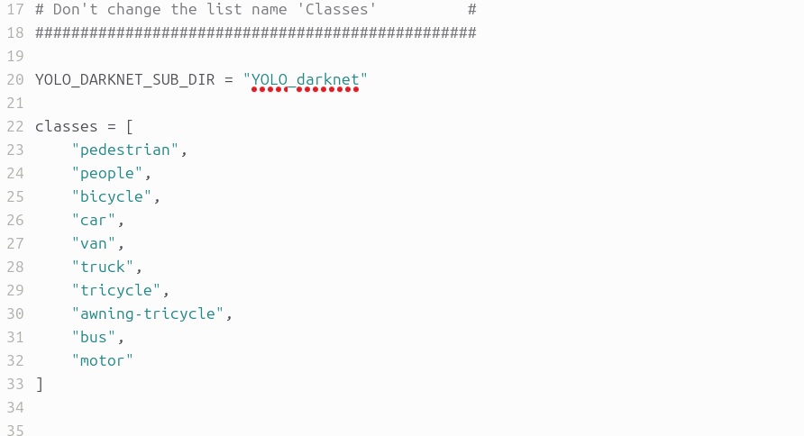
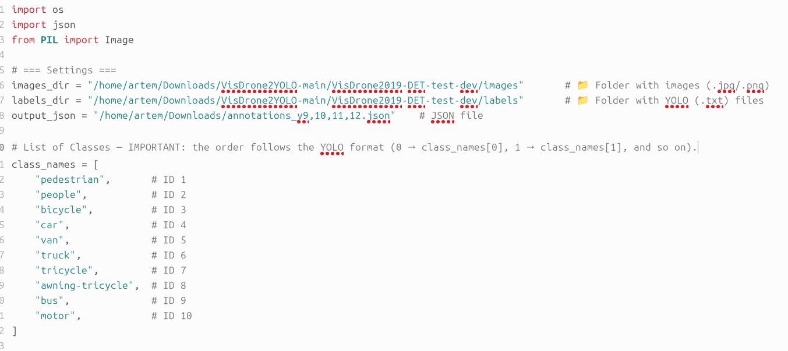

# YOLO-SAHI
This repository provides the source code for the thesis project "Improving Small Object Detection from Drones Using SAHI-YOLO".
# Instructions
## Installation
Install the following dependencies:
```
Anaconda          # Create inference and training environments on Ubuntu
```
Install additional dependencies:
```
pip install -r requirements.txt
```
Install your desired version of pytorch and torchvision:
```
pip install torch==2.7.0 torchvision==0.22.0 --index-url https://download.pytorch.org/whl/cu126
```
Install your desired detection framework (ultralytics):
```
pip install ultralytics>=8.3.161
```
Install SAHI:
```
pip install sahi
```
## Data Preparation
1. Download the [VisDrone](https://github.com/VisDrone/VisDrone-Dataset?tab=readme-ov-file) dataset(find Task1: Object Detection in Images and download folders: trainset, valset and testset-dev, and put the data into ```datasets/visdrone/.```
2. Download [VisDrone2YOLO](https://github.com/adityatandon/VisDrone2YOLO) - Converted labels from the VisDrone dataset to the YOLO format. Put this data into ```datasets/visdrone/labels```
3. After downloading, place the data in the following directory structure:
```
dataset/
├── visdrone/
│ ├── VisDrone2019-DET-train/
│ │ ├── images/
│ │ └── labels/
│ ├── VisDrone2019-DET-val/
│ │ ├── images/
│ │ └── labels/
│ └── VisDrone2019-DET-test_dev/
│ │ ├── images/
│ │ └── labels/
```
4. Use [Yolo-to-COCO-format-converter](https://github.com/Taeyoung96/Yolo-to-COCO-format-converter) to convert the VisDrone dataset's labels to COCO format (.json) for SAHI testing.
Requirements:<br>

numpy<br>
OpenCV<br>
You can make same environment with anaconda environment.
```
conda create -n Yolo-to-COCO python=3.8
conda activate Yolo-to-COCO
pip install numpy
pip install opencv-python
pip install imagesize
```
Just clone this repository.
```
git clone https://github.com/Taeyoung96/Yolo-to-COCO-format-converter.git
cd Yolo-to-COCO-format-converter
```
Change classes with your own dataset.<br>

In main.py, there is a code that declare the classes. You will change this with your obj.names.<br>
 <br>
Annotations are nested in a folder 'YOLO_darknet' <br>
Use this approach if your annotations are in nested a level below the image files like this:
```
    dataset_root_dir/
        YOLO_darknet/
            Photo_00001.txt
            Photo_00002.txt
        Photo_00001.jpg
        Photo_00002.jpg
```
Command to use:
```
python main.py --yolo-subdir --path <datasets/visdrone/dataset_root_dir> --output <VisDrone2019-DET_test_coco_start>
```
5. Convert YOLO (.txt) to COCO (.json) format for prediction outputs of YOLOv9–v12 models (without SAHI integration)<br>
Provide paths to the images and labels as shown in this figure<br>
 <br>
Command to use:
```
python convert.py
```
## Models Training
